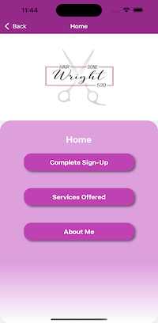

# Project Mullet 

HairDoneWright530 is located in Olivehurst, California and is privately owned by 
Melissa Wright. The HairDoneWright530 app is designed to connect Melissa with her clients and the clients to Melissa by providing an easy to use User Interface (UI) for use in the app. This app will help drive business to HairDoneWright530 by providing to the community a state licensed cosmetologists’s services in one application. The Administrator side of the app allows for booking appointments and changing of appointments, selection of clienttell, integrated schedule setting, customized notes and information for contacting clients, and for clients they can book and see available times Melissa has for appointments while also providing a convenient, and easy to use selection of available services. 

This project is being completed by a team from Sacramento State University called the Recycling Team as part of a Senior Project over the time span of 2 semesters.

# Table of Contents
- [Authors](#authors)
- [Project Flow (EERD)](#project-flow-eerd)
- [Installation](#installation)
  - [Setting up Simulators](#setting-up-the-simulators)
    - [Android Simulator](#android-simulator)
    - [IOS Simulator](#ios-simulator)
- [Running the Program](#running-the-program)
- [Testing](#testing)
- [Deployment](#deployment)
  - [Android Instructions](#android-deployment)
  - [IOS Deployment](#ios-deployment)
- [Screenshots](#screenshots)
  - [Terminal After Successfull Run](#terminal-after-successfull-run)
  - [Temporary Home Screen of App](#temporary-home-screen-of-app)
  - [3 Different Screens](#setup-appointment-modify-availability-client-appointment-screen)
  - [SetUp Appointment Screen 2](#setup-appointment-screen-2)
- [Jira Timeline](#jira-timeline)
  - [Sprint 1](#sprint-1)
  - [Sprint 2](#sprint-2)
  - [Sprint 3](#sprint-3)
  - [Sprint 4](#sprint-4)
  - [Sprint 5](#sprint-5)
  - [Sprint 6](#sprint-6)
  - [Sprint 7](#sprint-7)
  - [Sprint 8](#sprint-8)


## Authors

- [@Andrew Canada](https://github.com/CanadaAndrew) - Github
- [@Chris Wright](https://github.com/cdub-616) - Github
- [@Adrian Gonzalez](https://github.com/VoicelessBark44) - Github
- [@Andrew Covert](https://github.com/acovert2) - Github
- [@Leaith Rawashdeh](https://github.com/LeaithR) - Github
- [@Tai Tang](https://github.com/ttang0) - Github
- [@Cameron Ingersoll](https://github.com/CamIngersoll) - Github
- [@Wilson Toy](https://github.com/Wilson-Toy) - Github


## Project Flow (EERD)


## Installation

To install and run the project on your computer you will need to first clone the project on your local machine in the manor you wish either by downloading the source code or by using the provided command below. 

```bash
git clone https://github.com/CanadaAndrew/Project-Mullet
```

In addition to the listed dependencies below you will need npm and to create a expo app to run the app in.

```bash
npx expo install expo-linear-gradient
npm install --save react-native-calendars
npx expo install expo-router react-native-safe-area-context react-native-screens expo-linking expo-constants expo-status-bar react-native-gesture-handler
npm install react-native-dropdown-select-list
npm install axios
npm install mssql
npm install express
npm install cors
npm install moment-timezone
npm install @react-native-community/datetimepicker --save
npm install firebase
npm install @expo/vector-icons
npm install react-native-vector-icons
npm install firebase
npm install @react-native-async-storage/async-storage
npm install react-native-root-toast
```

## Setting up the Simulators

In order to run the project and properly test it youw will have to have a simulator available for expo to run the react native app on. There are many choices how you go about this but, my team used and tested on 2 different methods; IOS Simulator and Android.

### Android Simulator

The android simulator takes a bit more work to get running than the ios simulator but it has a lot of options for how you go about running the app on the simulator. Firrst you will need to download and install [Android Studio](https://developer.android.com/studio/install). Android Studio as of writing this section (5/1/24) runs on Windows, Some distros of Linux (Ubuntu), Mac OS, and Chrome OS. 

After downloading and installing Android Studio you will need to install a device to simulate Android on. The app should be fine for most versions of android devices such as Pixel phones. 

When launching the development server you will need to activate the simulator first and then click 'a' in the terminak for development server so that it starts launching the expo app on the andoid simulator.

### IOS Simulator

In order to run the IOS simualtor you will need either a IOS device or a Mac capable of running the IOS simulator (Most modernish Macs should be able to). The next step after securing a mac would be to go to the App Store and download [X-Code](https://apps.apple.com/us/app/xcode/id497799835?mt=12). 

Once in X-Code you will need to go to the settings page and from there platforms where you can select the version number and what kind of device you would like to simulate on. Then download the platform/device. You can either go to your simulators (Will appear in your application froms now on) or when lauching the developement server just click 'i' to load the app in the simulator and it should automatically activate and load the app into the simulator.


## Running the Program

To deploy this project type in the terminal:

```bash
npm run
```
Or you can type:

```bash
npx expo start
```
Both of these commands should start the prject and bring you to wall of text with a
QR code that you can scan to run the app on your phone. We recommend you use 'npx expo start'. If you don't want to run this project on your phone using the QR code you can download a simulator and run it locally.

## Testing

Testing can be done either manually or through semi-auto - to fully automatic testing. Our Development team performed testing mostly through manual testing of the different pages but some testing was done by using a dependency called Jest. You can install Jest by going to the terminal and pasting this command in:

```bash
npm install --save-dev jest
```

There are many ways to use Jest withing the confines of the project. The base version of Jest however, cannot work with react native or TypeScript so extra dependencies will need to be installed. With some manual work in the configs of the project. We will provide the following command for the different dependencies but you should go the Jest website and follow their instructions because it may have changed by the time you are working on this project. 

React Native:
```bash
npm install --save-dev jest @testing-library/react-native react-native-testing-library
```

For [TypeScript](https://jestjs.io/docs/getting-started):
```bash
npm install --save-dev @types/jest
```

In order to run tests on various functions you will to make a file that ends with .test as Jest will know to run the tests on files that end with it. 

An Example of Jest code is provided with the SignUp Page's functions:


Jest will after running the following command:

```bash
npm test
```

Will automatically run tests on all files that have .test in it. An example with SignUp.test.js being run is below:


## Deployment

### Android Deployment

There are several ways to deploy to the Google Play store for Android. This will explain the steps we used to deploy to the Google Play Store.

Expo uses a client called [EAS](https://expo.dev/eas) which requires an account to use. Next you will need to open up and connect your Android simulator. Next you will need to open up your terminal and install the EAS Client by running this command:

```bash
npm install -g eas-cli
```

Next you will need to create an `eas.json` file in the root folder of the project. Which should contain the following code:

```json
{
  "build": {
    "production":{}
  },
  "cli": {
    "requireCommit":true
  }
}
```

The next step is to choose which platform to build the app for. We wil be choosing Android for this specidic tutorial so the user will need to enter the following command into the Terminal:

```bash
eas build --platform android
```

This should if there aren't any error create an APK that can be used to submit to the Google Playstore or just run locally. If there are errors the following instructions will help you diagnose and deal with them.

You should make another Github branch for the work you are about to do. In order to help find errors you will run the following command:

```bash
npx expo prebuild
```
or
```bash
npx expo prebuild --platform android
```

This should create an android folder using the app.josn file from expo. From here you can explore and experiment with the diferent potential errors you are getting within the confines of a prebuild. If you would like to test the prebuild locally you can run the following command:

```bash
eas build --platform android --local
```

If you are using a Mac or Linux you can use:

```bash
npx expo run::android
```
*For testing you will need to add an additonal file called `local.properties` and add the location of your android SDK*

*For Windows Users the default location is:*

`sdk.dir=C\:\\Users\\USERNAME\\AppData\\Local\\Android\\sdk`

*For Mac OS users:*

`sdk.dir = /Users/USERNAME/Library/Android/sdk`

*For Linux Users:*

`sdk.dir = /home/USERNAME/Android/Sdk`

Finally to submit to the Google Play Store you will need to sign in with your developer account and click on the **App Bundle Explorer** to see the lost of AABs. Once clicked there should be a button called **Upload new version** which you can use to creae a new release or to update the app. 
### IOS Deployment

There are several ways to deploy to the Apple App Store for IOS. This will explain the steps we used to deploy to the Apple App Store.

Expo uses a client called [EAS](https://expo.dev/eas) which requires an account to use. Next you will need to open up and connect your Android simulator. Next you will need to open up your terminal and install the EAS Client by running this command:

```bash
npm install -g eas-cli
```

Next you will need to create an `eas.json` file in the root folder of the project. Which should contain the following code:

```json
{
  "build": {
    "production":{}
  },
  "cli": {
    "requireCommit":true
  }
}
```

The next step is to choose which platform to build the app for. We wil be choosing IOS for this specidic tutorial so the user will need to enter the following command into the Terminal:

```bash
eas build --platform ios
```

This should if there aren't any error create an IPA that can be used to submit to the Apple App Store or just run locally. If there are errors the following instructions will help you diagnose and deal with them.

You should make another Github branch for the work you are about to do. In order to help find errors you will run the following command:

```bash
npx expo prebuild --platform ios
```

This should create an ios folder using the app.josn file from expo.

For some Macs you may get an error and it can be a multitude of errors. These are ones we encountered and how to fix them:

If you need ot update/install cocoa pods, it should give you a command using gem. If sudo isn't working, use the command:

```bash
gem install cocoapods --user-install
```

Next it may say that Pods do not exist in which case you will need to move your current working directory to the ios directory and run the command:

```bash
Pods install
```

After the sucessfull IPA build that is generated you will login into the Apple App Store with your developer account and submit the new IPA build for review and deployment to your app. 

## Screenshots of the App

### Terminal After Successfull Run


### Login Screen


### Sign-Up Page


### Admin Screen


 

### Current User


 


### Approved New User



### Unapproved User (New Client)


## Jira Timeline
### Sprint 1 
Sprint Start Date: 2023/9/17

Sprint End Date: 2023/10/2

Goals for the Sprint: 
Find a client to work with and Create a Project Proposal to complete said project. After a Successful project proposal and approval begin working with client to design the project.

Completion Status: Succesfully completed all goals this sprint. Recycling Team will be working together with HairDoneWright530 to create a beauty app for connecting to clients and managing appointments all within one app.

### Sprint 2
Sprint Start Date: 2023/10/08

Sprint End Date: 2023/10/22

Goals for the Sprint: Create all documentation necessary for the project and begin researching database providers and all other elements of the technology stack that will be used in this project with budget proposals for the app's development and continued use after Senior Project in May of 2024. 

Completion Status: All tasks completed with documentation sent and approved by the professor, Lab Advisor and the client Melissa Wright. Research into Technology Stack was completed with a decision to use Microsoft Azure for backend Storage in SQl.

### Sprint 3
Sprint Start Date: 2023/10/14

Sprint End Date: 2023/11/12

Goals for the Sprint: Begin coding of the app using Expo in Visual Studio Code. Tasks were assigned to team members in Jira to complete and were instructed to from now on when submitting a Pull Request into main to put their Jira task number they were completing. Microsoft Azure account is to be set up for Sprint 4 development. 

Completion Status: Almost every task was completed. Calendar functionality was implemented into the different pages that were created for this Sprint. Dummy Data is currently being displayed for the pages with no connection to backend yet. All work that was to be completed with backend could not be completed due to issues with setting up MicroSoft Azure Account. Will be resolved by Sprint 4.

### Sprint 4
Sprint Start Date: 2023/11/13

Sprint End Date: 2023/11/27

Goals for the Sprint: Finish up the admin schedule pages, and creating the client schedule pages, along with database communications.

Completion Status: Complete

### Sprint 5
Sprint Start Date: 2024/02/10

Sprint End Date: 2024/02/11

Goals for the Sprint: Create a new and improved HomeScreen, Upcoming Appointment Screen, and LogIn Screen.

Completion Status: Complete

### Sprint 6
Sprint Start Date: 2024/02/14

Sprint End Date: 2024/02/26

Goals for the Sprint: Development the client and admin interaction with client screens. Create a client sign up screen, ClientInfo Screen (Admin Side), and Client Approval Screen (Admin). If there is time the ability to modify client info will be added as well the ability to reset password/email for an account or update email/login for an account.

Completion Status: Complete

### Sprint 7
Sprint Start Date: 2024/02/26

Sprint End Date: 2024/03/12

Goals for the Sprint: Complete the last tasks from Sprint 6 that may not have been started due to time or couldn't be completed. After previous Sprint tasks are done make an AboutMe page for Melissa Wright, FAQ page, and Services offered Screen.

Completion Status: Complete

### Sprint 8
Sprint Start Date: 2024/03/12

Sprint End Date: 2024/03/31

Goals for the Sprint: Complete any tasks leftover from Sprint 7 and after these are completed use whatever left over time to polish the program and fix any bugs we can.

Completion Status: Complete

### Sprint 9

Sprint Start Date: 2024/04/01

Sprint End Date: 2024/04/15

Goals for the Sprint: Update the app with changes requested by the Client, update the server to be faster, begin deployment of the Android app and ios version. Begin documentation required for the end of the semester. 

Completion Status: Complete

### Sprint 10

Sprint Start Date: 2024/04/15

Sprint End Date: 2024/04/29

Goals for the Sprint: Finish last bugs before the end of the semester and project due and begin/finish deployment to the Google and Apple App store.

Completion Status: Complete

